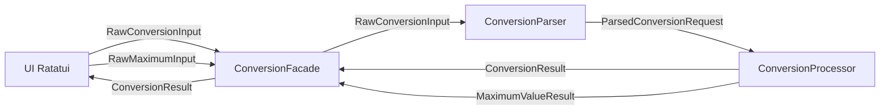
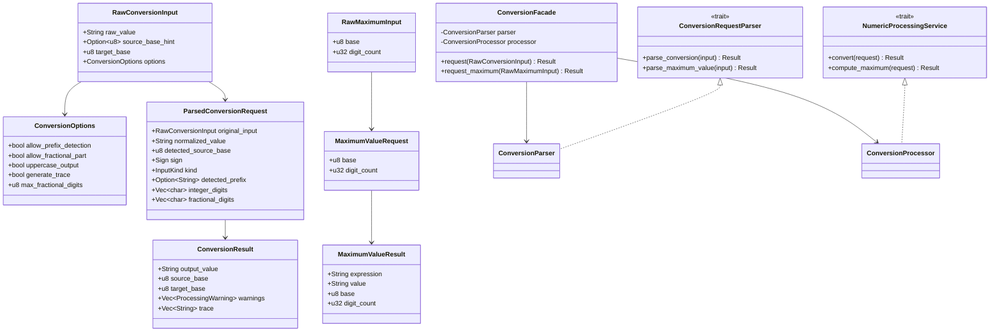
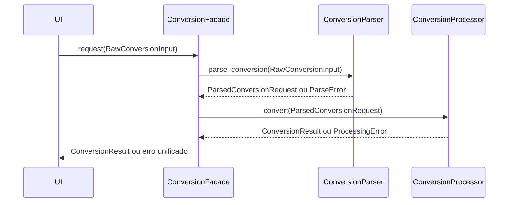
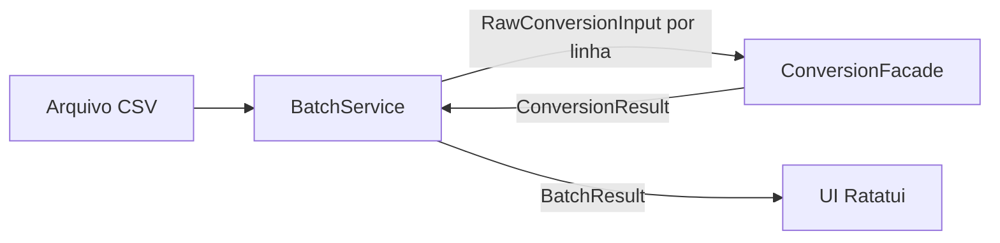
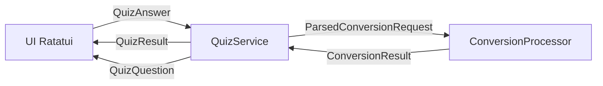

# Arquitetura Proposta

Este documento define uma arquitetura minima para o projeto, com foco em permitir desenvolvimento assincrono entre core e UI.

## Objetivos

- Separar entrada, validacao e normalizacao da etapa de processamento.
- Expor contratos estaveis para a UI mesmo antes da logica de conversao ficar pronta.
- Manter a implementacao do desafio isolada atras de traits e DTOs claros.

## Modulos

- `contracts::dto`: DTOs compartilhados entre parser, processamento e UI.
- `contracts::errors`: erros de parser e processamento.
- `contracts::parser`: contrato e implementacao do parser.
- `contracts::processor`: contrato e implementacao do processador.
- `contracts::facade`: `ConversionFacade` — ponto de entrada unico para a UI, encadeando parser e processador internamente.
- `contracts::batch`: `BatchService` — servico de processamento de multiplas conversoes a partir de CSV.
- `contracts::quiz`: `QuizService` — servico de geracao e correcao de questoes, irmao da facade.

## Fluxo principal

A UI nunca instancia o parser ou o processador diretamente. Ela fala apenas com a `ConversionFacade`, que gerencia o pipeline interno.



## Diagrama de classes



## Responsabilidade de cada camada

### ConversionFacade

Orquestrador unico exposto para a UI. Recebe a entrada bruta, delega ao parser, repassa ao processador e devolve o resultado final. A UI nao precisa conhecer a existencia de parser ou processador.

### Parser

Responsavel por transformar a entrada bruta da UI em uma requisicao validada e normalizada.

Entradas esperadas:

- valor digitado pelo usuario
- base de origem opcional
- base de destino obrigatoria
- flags de comportamento via `ConversionOptions`

Saidas esperadas:

- valor normalizado
- base de origem final, seja informada ou detectada via prefixo
- separacao entre parte inteira e fracionaria
- metadados que a UI pode exibir sem conhecer a logica de conversao

### Processador

Responsavel por executar os casos de uso do dominio a partir de requisicoes ja parseadas.

Casos de uso previstos:

- conversao entre bases
- geracao de trace passo a passo
- calculo do maior valor representavel em uma base

## DTOs prioritarios para a UI

### Entrada de conversao

`RawConversionInput` deve ser preenchido pela UI e enviado para `ConversionFacade::request`.

Campos:

- `raw_value`: texto puro digitado pelo usuario.
- `source_base_hint`: base informada manualmente. Pode ser `None` para delegar autodeteccao ao parser via prefixo.
- `target_base`: base desejada para a resposta.
- `options`: flags de comportamento descritas abaixo.

#### Flags de `ConversionOptions`

| Flag | Tipo | Padrao | Descricao |
|------|------|--------|-----------|
| `allow_prefix_detection` | `bool` | `true` | Quando ativo, o parser detecta prefixos como `0b` (binario), `0o` (octal) e `0x` (hexadecimal) e usa a base correspondente, ignorando `source_base_hint` caso haja conflito. |
| `allow_fractional_part` | `bool` | `true` | Permite entrada com parte fracionaria separada por `.`. Se desativado e o usuario digitar um ponto decimal, o parser retorna `ParseError::FractionalInputDisabled`. |
| `uppercase_output` | `bool` | `true` | Letras maiusculas no resultado para bases acima de 10, como `1F` em vez de `1f`. |
| `generate_trace` | `bool` | `false` | Quando ativo, o processador preenche `ConversionResult.trace` com os passos formatados do algoritmo. Se desativado, `trace` e retornado como vetor vazio. |
| `max_fractional_digits` | `u8` | `16` | Limite de casas fracionarias no resultado via multiplicacoes sucessivas. Quando atingido em resultado nao terminante, o processador adiciona `ProcessingWarning::FractionTruncated` nos avisos. |

### Saida de conversao

`ConversionResult` ja esta pronto para renderizacao direta na UI.

Campos:

- `output_value`: valor final convertido como string.
- `source_base`: base realmente usada na origem.
- `target_base`: base da resposta.
- `warnings`: avisos nao bloqueantes que a UI pode exibir opcionalmente.
- `trace`: vetor de strings ja formatadas pelo processador. Cada item e uma linha pronta para exibir na aba de passo a passo. Vazio quando `generate_trace` e `false`.

Exemplo de `trace` para a conversao de 42 decimal para binario:

```
"42 ÷ 2 = 21  r 0"
"21 ÷ 2 = 10  r 1"
"10 ÷ 2 =  5  r 0"
" 5 ÷ 2 =  2  r 1"
" 2 ÷ 2 =  1  r 0"
" 1 ÷ 2 =  0  r 1  ←"
"Resultado (lendo de baixo para cima): 101010"
```

### Entrada e saida do maximo representavel

Use `RawMaximumInput` para chamar `ConversionFacade::request_maximum`. O retorno `MaximumValueResult` traz `expression` e `value` prontos para exibicao, como `"2^8 - 1 = 255"`.

## Sequencia sugerida entre backend e UI



## Outros casos de uso

Alem da conversao basica, o trabalho exige funcionalidades adicionais. Cada uma e atendida por um servico irmao da `ConversionFacade`, todos usando os mesmos DTOs e contratos ja definidos.

### Passo a passo — F7

Nao requer interface nova. E controlado pela flag `generate_trace: true` em `ConversionOptions` ao chamar `ConversionFacade::request`. O processador preenche `ConversionResult.trace` com uma linha por passo do algoritmo. A aba Trace na UI le esse vetor diretamente e controla qual linha esta destacada com um indice local de `etapa_atual`.

### Batch — F8

Um `BatchService` e um servico irmao que le um CSV, monta um `RawConversionInput` por linha e delega cada um para `ConversionFacade::request`. O retorno e um `BatchResult` contendo `Vec<ConversionResult>` e um resumo de quantas linhas falharam e por que.



DTOs do batch:

- `BatchResult`: vetor de `ConversionResult` correspondente a cada linha, mais um campo `errors` com os indices de linha que falharam e o erro associado.

### Quiz — F9

Um `QuizService` e um servico irmao que gera questoes aleatorias e valida respostas. Internamente ele usa o `ConversionProcessor` diretamente para calcular a resposta esperada e comparar com a entrada do usuario.



DTOs do quiz:

- `QuizQuestion`: valor a converter, base de origem, base de destino, nivel de dificuldade (1 a 5).
- `QuizAnswer`: string digitada pelo usuario e tempo de resposta em milissegundos.
- `QuizResult`: flag de acerto, resposta esperada, pontuacao acumulada na sessao.

Os 5 niveis de dificuldade mapeiam restricoes sobre quais bases e tamanhos de numero sao sorteados. Nivel 1 usa apenas bases 2 e 10 com numeros de 1 digito; nivel 5 usa qualquer base entre 2 e 36 com parte fracionaria opcional.

### Maximo representavel — F10

Ja coberto por `ConversionFacade::request_maximum`. A formula $2^k - 1$ e calculada internamente pelo processador e a expressao formatada chega pronta em `MaximumValueResult.expression`.

## Observacoes de implementacao

- A UI deve depender apenas de `ConversionFacade`, `BatchService` e `QuizService`, nunca do parser ou processador diretamente.
- A logica real de conversao pode evoluir internamente sem quebrar a camada de apresentacao.
- Servicos irmaos (`BatchService`, `QuizService`) podem instanciar `ConversionFacade` ou `ConversionProcessor` diretamente conforme necessidade.